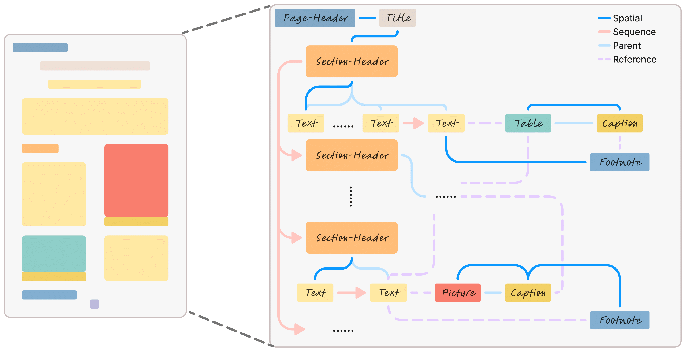

<h1 align="center">Graph-based Document Structure Analysis (ICLR'25)</h1>

<p align="center">
    <a href="https://arxiv.org/pdf/2403.14442.pdf">
    </a>
    <a href="https://yufanchen96.github.io/projects/GraphDoc/">
    </a>
    <a href="https://pytorch.org/get-started/previous-versions/#linux-and-windows">
    </a>
    <a href="https://github.com/yufanchen96/GraphDoc/blob/main/LICENSE">
    </a>
    
</p>

## 🏡 Project Homepage

This is the official repository for our ICLR 2025 paper **Graph-based Document Structure Analysis**. For more results  details, please visit our [project homepage](https://yufanchen96.github.io/projects/GraphDoc/).
    
## 🔎 Introduction
we construct a relation graph-based document structure analysis dataset (GraphDoc), enabling training models to complete tasks like reading order, hierarchical structure analysis, and complex inter-element relation inference. Furthermore, a document relation graph generator (DRGG) is proposed to address the tasks.
<p align="center">
    
</p>

## 📝 Catalog
- [ ] Graph-based Document Structure Dataset
- [ ] DRGG Model Checkpoints
- [ ] DRGG Model Training Code
- [ ] DRGG Model Evaluation Code

## 📦 Code and Implementations

Code and Implementation details will come soon!

## 🌳 Citation
If you find this code useful for your research, please consider citing:
```
@inproceedings{chen2025graphdoc,
      title={Graph-based Document Structure Analysis}, 
      author={Yufan Chen and Ruiping Liu and Junwei Zheng and Di Wen and Kunyu Peng and Jiaming Zhang and Rainer Stiefelhagen},
      booktitle={ICLR},
      year={2025}
}
```
